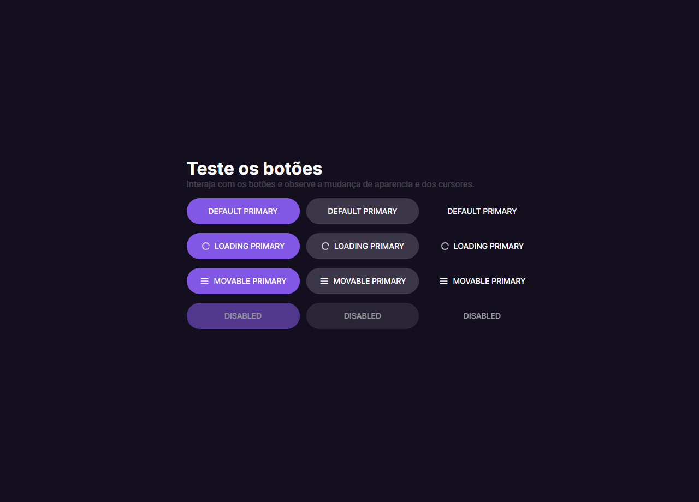

<h1 align="center"> Botões e Cursores BoraCodar #03 </h1>

Projeto desenvolvido para finalização do desafio número 03 do programa Bora Codar da RocketSeat.  

  <a href="#-tecnologias">Tecnologias</a>&nbsp;&nbsp;&nbsp;|&nbsp;&nbsp;&nbsp;
  <a href="#-projeto">Projeto</a>&nbsp;&nbsp;&nbsp;|&nbsp;&nbsp;&nbsp;
  <a href="#memo-licença">Licença</a>

  

 

  

## 🚀 Tecnologias

Esse projeto foi desenvolvido com as seguintes tecnologias:

- HTML e CSS
- Git e Github
- Figma

## 💻 Projeto

O DevLinks é uma aplicação web para auxiliar você a testar os botões e suas funcionalidades para os seus projetos.

- [Visite o projeto online](https://b-teixeira.github.io/buttons-test/)

## :memo: Licença

Esse projeto está sob a licença MIT.

---